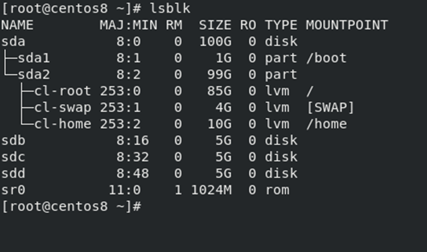
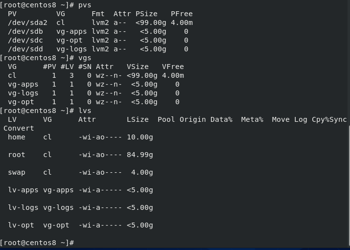
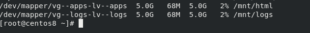
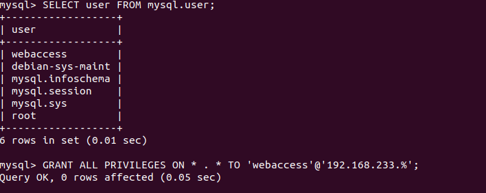
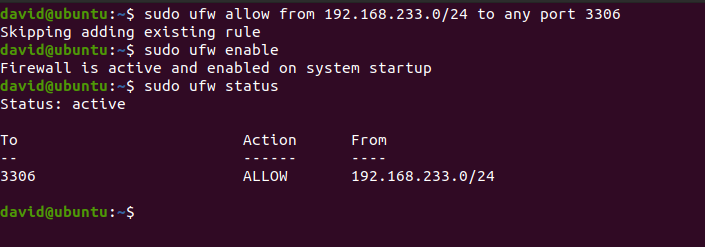
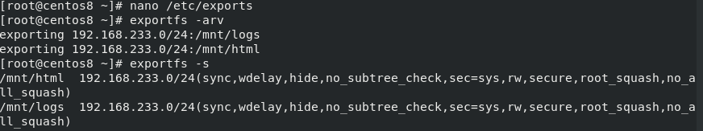
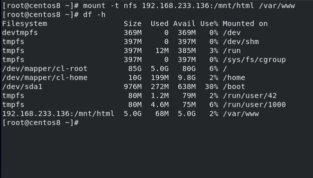
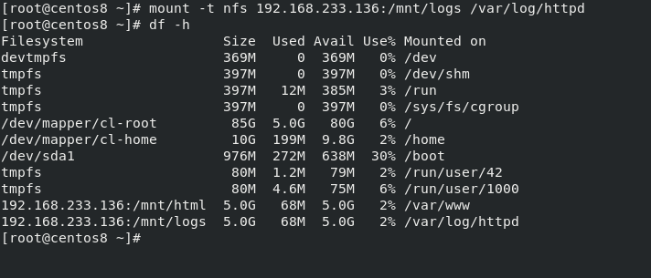
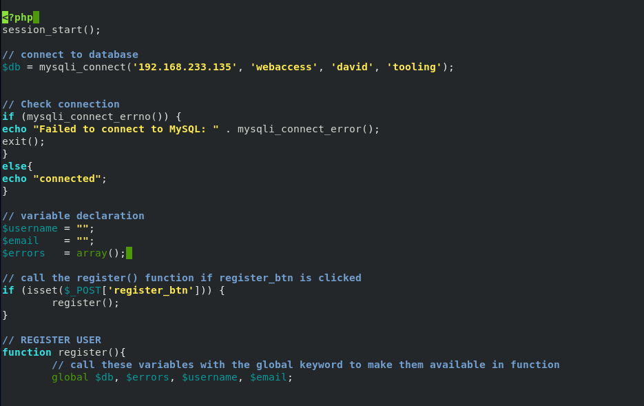
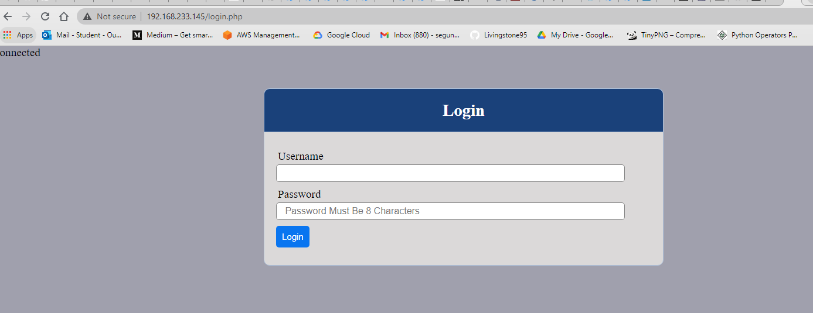

# **Devops Tooling Website Solution, A PBL Progressive Project from** [Darey.io](https://darey.io/)

## Setup is based on;
1. Infrastructure: VmWare Player
2. Webserver Linux Distro: Centos
3. Database Server Linux Distro: Ubuntu
4. Storage: NFS
5. Programming Language: PHP
6. Code Repository: GitHub

## Step 1; Preparing the NFS Server:

- Change to root user

   `sudo su -`
    
1. **check all disk available on the machine**

    `lsblk`

> Before logical Volumes can be created, physical volumes and volume group must be created first.
2. **To create Logical volumes with the the disk**

  - To create physical volumes 
 `pvcreate /dev/sdb /dev/sdc /dev/sdd`

- To create Volume groups for apps, logs and opt

   `vgcreate vg-apps /dev/sdb`
 `vgcreate vg-logs /dev/sdc`
  `vgcreate vg-opt /dev/sdd`

- To create logical volumes for apps, logs and opt
  `lvcreate -l 100%FREE -n lv-apps vg-apps`
    `lvcreate -l 100%FREE -n lv-logs vg-logs`
-  `lvcreate -l 100%FREE -n lv-opt vg-opt`

3.**To mount the logical volumes**
> To mount the logical volumnes, a mount point will be created first, then it will be formated with a filesystem. For this project it was dformatted in `xfs` filesystem.

- Make directory for html
    `mkdir /mnt/html`  
- Make directory for logs
`mkdir /mnt/logs`  

>Formatting all Logical volumes to an `xfs` filesystem before mounting the logical volumes on the mount point

- `mkfs.xfs /dev/vg-apps/lv-apps`

- `mkfs.xfs /dev/vg-logs/lv-logs`

>Mounting the Logical volumes

- `mount /dev/vg-apps/lv-apps` 

- `mount /dev/vg-apps/lv-apps`

  

>To confirm the mounts

- `df -h`

4. **To install and configure NFS server**
   
- Install nfs server

  `dnf install nfs-utils -y`
- start nfs server

  `systemctl start nfs-server.service`
  
 - enable the nfs server to boot on startup
 
   `systemctl enable nfs-server.service` 
  
- confirm the status of nfs server

  `systemctl status nfs-server.service`
 
5. **To exports the mount for the webservers**
>To avoid file restrictions on the NFS share directory, it’s advisable to configure directory ownership as shown. This allows creation of files from the client systems without encountering any permission issues.

- For `/mnt/html`
   `chown -R nobody: /mnt/html`
  `chmod -R 777 /mnt/html`

- For `/mnt/logs`
`chown -R nobody: /mnt/logs`
`chmod -R 777 /mnt/logs`

> To exports the mounts points, i edited the `/etc/exports` and paste the following. The IP address 192.168.233.0/24 is the IP range covering all the IPs of the webservers client.

   `sudo nano /etc/exports`

>                             /etc/exports
    /mnt/html 192.168.233.0/24(rw,sync,no_all_squash,root_squash)
    /mnt/logs 192.168.233.0/24(rw,sync,no_all_squash,root_squash)

- For the cahnges to be effected, the nfs servcer must be restarted

  `systemctl restart nfs-utils.service`

- To export the files that has been created

  `exportfs -arv`
- To display exported files

  `exportfs -s`

- Configure the firewall to allow clients
>`firewall-cmd --permanent --add-service=nfs`
`firewall-cmd --permanent --add-service=rpc-bind`
`firewall-cmd --permanent --add-service=mountd`
`firewall-cmd --reload`

>To ensure that all the configuration is persistent after reboot this was pasted in the `/etc/fstab` folder

    `sudo nano /etc/fstab`
>                            /etc/fstab
    UUID=bcf9c9e6-191c-4e23-aad8-72d8f9415c2e /mnt/lv-apps xfs defaults,nofail 0 0
    UUID=94c434a5-3fbf-4f22-8ad9-75072ceb9c3b /mnt/lv-logs xfs defaults,nofail 0 0
    UUID=24ae87df-68b3-43e5-9f3e-2febb6ba7a0e /mnt/lv-opt xfs defaults,nofail 0 0
    
Step 2; Configuring The Database

1. Installing MySQL

- Installing mysql-server

  `dnf install mysql-server`

- Start mysql service

  `systemctl start mysqld.service`
  
- Confirm the status of mysql-server

  `systemctl status mysqld`

- To enable mysql-server on startup

  `systemctl enable mysqld`

- To secure mysql installation

   `mysql_secure_installation`
   
> Appropiate answers was given to prompted questions

>To create a database and a user

  - to login to mysql server as a root user
  
       `mysql -u root -p`

   - create database 
   
      `CREATE DATABASE tooling`
 
  
   - create user webaccess and grant appropiate access
  > `CREATE USER 'webaccess'@'192.168.233.0/255.255.255.0' IDENTIFIED WITH mysql_native_password BY 'david';`
`GRANT ALL PRIVILEGES ON tooling.* TO 'webaccess'@'192.168.233.0/255.255.255.0' WITH GRANT OPTION;`
`FLUSH PRIVILEGES;`

- to exit of the database server

     `exit`
     
- to allow traffic only from the webservers `subnet cidr`

    `ufw allow from 192.168.233.0/24 to any port 3306`
    
    
  
## Step 3: Preparing The webservers

> To allow the webserver connect to the database server as a client, Mysql-common has to be installed.

1. install nfs-client

   `dnf install nfs-utils nfs4-acl-tools -y`

- to show the availabale exports folder in the NFS storage

    `showmount -e 192.168.233.136`
    
    

2. To mount `/var/www/`  targeting the export for apps

* make directory

  `mkdir /html.bak`
  
* backup `/var/www` before mounting

    `cp -R -v /var/www/ /html.bak`
    
* mount the directory
  
     `mount -t nfs 192.168.233.136:/mnt/html /var/www`
     
     
    
* copy the backup directory back to `/var/www`

     `cp -R -v /html.bak/* /var/www/`

     
     
   
   
3. Install apache

   `dnf install httpd`

- start httpd server

   `systemctl start httpd`

- configure the firewall
>`firewall-cmd --permanent --add-service=http`
`firewall-cmd --permanent --list-all`
`firewall-cmd –reload`

4. The log folder for apache is `/var/log/httpd`

* make directory

    `mkdir /httpd-log.bak`
  
* backup `/var/www` before mounting

    `cp -R -v /var/log/httpd /httpd-log.bak`
    
* mount the directory
  
    `mount -t nfs 192.168.233.136:/mnt/logs /var/log/httpd`
    
    
    
* copy the backup directory back to `/var/www`

     `cp -R -v /httpd-log.bak /var/log/httpd`

      
    
      

    
5. >I followed the steps in the this [link](https://youtu.be/f5grYMXbAV0) to fork a repository.

6. >To deploy the tooling website to the webserver
after forking the tooling repository to my github account.

- clone the repository to my local machine

  `git clone https://github.com/Livingstone95/tooling.git` 

* Copy the html folder into /var/www/html

   `cp -R -v tooling/html/*  /var/www/html`
   
> By defaults, SElinux will not allow httpd to automatically write to log file and or content files. A policy will be created to allow httpd to write to content and log files, allow httpd to connect to nfs, and allow httpd to connect remotely to the database

* Create a policy to assign the httpd_sys_content_t context to the `/var/www/html` directory, and all child directories and files

   `semanage fcontext -a -t httpd_sys_content_t "/var/www/html(/.*)?"`
   
 * policy to assign the httpd_log_t context to the logging directories
   
    `semanage fcontext -a -t httpd_log_t "/var/log/httpd/logs(/.*)?"`
    
* to allow the webserver to connect the database

    `setsebool -P httpd_can_network_connect 1`
    `setsebool -P httpd_can_network_connect_db 1`
    
* connecting to the  database from  the webserver

   `mysql -h 192.168.233.135  -u webaccess -p tooling < tooling-db.sql`
   
 
 * creating an sql file for the database
 
    `nano tooling-db.sql`

* importing the sql file into the database

  `mysql -u webaccess -p tooling < tooling-db.sql`
  
* Editing the `functions.php` to allow remote connection

    `nano /var/www/html/functions.php`
    
    
    
    
* Connecting to the website

